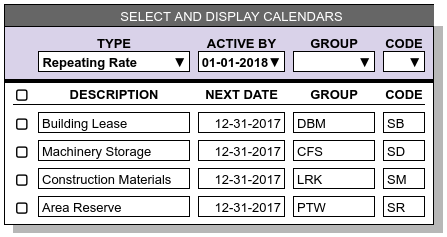

.. _bill-apply:

##############################
Generating or Entering Charges
##############################

**Standard Contract Terms** and **Rate Quotation** reports categorize business 
services. This topic explains how charges for those services are determined and 
accumulated for billing. 

Most charges are applied to activities, with the exception of charges which are 
generated from calendar events. Charge records are keyed by a combination of 
the transaction identifier of the source activity, and the payer of the charge. 
Usually the payer is the account associated with the activity transaction. 
Where a calendar event creates a charge, or where a charge is applied without 
an associated activity, a sequential counter supplies the charge identifier. 

WARES uses five mechanisms to capture charges: clerical entry, generation from
activity, generation from calendar, product calculations from activity, and 
product calculations from calendar. 

Optional Entered Charges
=============================

Certain types of charges are inherently optional; these charges require a 
clerical entry. Here are some circumstances where optional entry is required:

*  The rate or charge for an item varies and cannot be determined in advance, 
   as with freight charges for an overpacked package.
*  The occurrence of an action cannot be predicted, such as having to restack a 
   pallet or replace a broken pallet shell.
*  The quantity of an item cannot be predicted, as would happen with labor 
   charges for performing a physical inventory.
*  An event happens across many accounts, but with very low frequency, and so 
   the rate is made Global. Global rates are always optional.

Optional charges can be entered for an activity up to the point that the 
transaction is completed, verified, and released to billing calculation. An 
example of of the charges entry page for an activity follows:

.. image:: _images/charge-line-entry-1.png

Once mandatory and calculated charges are added to an activity, editing the 
charges is not an option. The charge entry page shows all the charges including
the mandatory code **MB** line, but the page becomes view-only as shown:

.. image:: _images/charge-line-entry-2.png

.. note::
   *  The deficit column is visible but entries are calculated and protected
   *  Quantity, Factor, Minimum, and Surcharge entries used in rate formulas 
      are not shown

.. tip::
   The *Clerical Labor* seems not to extend correctly, as the **Amount** times
   the **Rate** would be $1.50. But for this rate, the quantity is not per each 
   hour, but per each *Quarter-hour*. See the topic on :ref:`rate-extend` for 
   details on how charges are calculated.

Generated Charges
=============================

The billing for an activity transaction can be hand-calculated by setting the 
transaction's status, but this does not leave a batch calculation audit trail. 
Further, changing status by hand is not a satisfactory method for updating 
charges on hundreds of transactions at a time. 

For all rates which are not optional, WARES uses batch methods to generate the 
charges. Each batch has a unique identifier, a record of the batch input, start 
and end datetimes, and a count of transactions processed. Also each charge 
record created or updated by a batch method is stamped with the batch 
identifier.

Batch billing routines include user controls to select or filter the records to 
process. In this way, the user easily manages billing for hundreds or thousands 
of records at a time. 

Mandatory Generated Charges
=============================

A billing batch process selects completed activity transactions, closing them 
to updates and creating or updating manatory and calculated charges. 

The default is to process transactions for all accounts in all activities, 
beginning from the start of the open period until the end of the open period, 
or until the current day if that is earlier.

Since billing routines prevent further updates to transactions, this global 
selection rule is not always desirable. WARES displays a user control to select 
which records from activity are ready for billing:

.. image:: _images/cal-activity.png

To process a transaction, rates are selected based on the following criteria:

*  Only mandatory and calculated rates are considered in this section
*  Rates must belong to the transaction's account, or to groups not associated 
   with an account
*  Rates must reference the activity of the transaction 

Before calculating billing on a transaction, the set of possible charge record 
identifiers is generated based on the transaction identifier and the payers 
specified on the selected rates. Mandatory and Calculated charge lines with 
these charge identifiers are then selected and deleted. 

Rate calculation proceeds as follows for each mandatory rate record:

#. An **Amount** is determined for the rate's **Per** unit associated with the 
   **Activity**
#. If this **Amount** is not zero, it is used to calculate a **Deficit**, a 
   **Rate**, and a **Charge** as described in :ref:`rate-extend`
#. A charge transaction is written for the mandatory charge, identified by the
   transaction **Identifier**, the **Payer**, and the **Service** code. 

This description makes it clear that a mandatory rate creates a single charge 
line. Where a mandatory rate refers to something like case picking, the **Per** 
code must calculate a total for the entire transaction.

Product Calculated Charges
=============================

Once mandatory charges are applied to a transaction, another billing routine 
applies calculated charges to each line item of the transaction. Lines are read 
in sequence, and the product is checked to determine a rate group identifier. 
Then rates are selected to apply based on the criteria:

*  Only calculated rates are considered
*  Rates must belong to the product's rate group
*  Rates must reference the activity of the transaction

Now for the line, rates are applied as follows for each calculated rate record:

#. Using the rate's **Per** unit for the **Activity**, an **Amount** is 
   calculated for the line
#. If this **Amount** is not zero, it is used to calculate a **Deficit**, a 
   **Rate**, and a **Charge** as described above 
#. A charge transaction is written for the calculated charge, identified by the
   transaction **Identifier** and **Line**, the **Payer**, and the **Service** 
   code. 

This sounds like the way Mandatory charges are applied, and it is. The 
difference is in applying rates one transaction line at a time based on the 
line's product rate group.

Repeating Calendar Charges
=============================

Repeating charges are applied by selecting scheduled rates from the calendar 
list, while calling a billing routine to apply the charges. Each calendar entry 
will generate one charge line item. Charges calculated from calendar events are 
identified by a sequential charge number, the payer id, and the service code. 
There is no associated activity.

An example calendar selection page for Repeating Rates follows:

The **Active By** calendar date defaults to the current date for selection, 
while the **Next Date** of each rate is used to update calendars during 
calculation. Setting the **Active By** date to a future date allows billing 
calculations based on calendars to be calculated in advance. This feature is 
useful when the end of a period falls on a weekend, for example.

Note that the typical **Group** for a repeating rate is an account identifier,
and codes used may vary. In this example, the accounting implications of a 
building lease are different from long-term machinery storage, and so the 
service codes for these two rates are different. 

Recurring Calculated Charges
=============================

For stored product, a routine calculates recurring product storage charges 
based on an account's recurring calculation settings and calendar. Recurring 
storage charges are identified by a sequential charge number and the payer id. 
Each charge is associated with a single product, and the charge is linked to 
a recurring storage audit table which documents stock activity and balances for 
product and lot quantities.

The following image shows the calendar selection page for recurring  Calculation:

.. image:: _images/cal-recurring.png

Note that the filter allows selection by **Account** rather than **Group**, and 
the code **1S** of associated rates is auto-filled.

See the :ref:`bill_recurring` article for more information on how recurring 
storage charges are calculated and audited.
