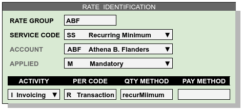

.. _bill-recur-example:

#############################
Recurring Issues and Examples
#############################

(Screen shots and transaction details to be added later.)

Many programs which attempt to calculate 3PL warehouse billing are not able to 
produce a correct bill for some common recurring methods. Fortunately there is 
WARES. This section provides examples of issues with recurring storage billing, 
activity reconciliation, and similar topics. 

Inventory in Recurring
=============================

Measuring inventory for recurring storage differs from reporting stock on hand 
and available for a number of reasons, as follows.

*  **Tracking** may be used to report inventory by bulk product, but stock 
   rotation and recurring billing depend on received dates, and therefore inventory is always accounted for by receipt date. 
*  **Reporting** of inventory may be by package or unit while calculating 
   and reporting storage charges by weight or cube. 
*  **Minimum** fees may imply deficit quantities or rounding, so that billed 
   quantities do not match reported inventory.
*  **Damaged** or **quarantined** goods are not reported in available inventory 
   but all goods are included in recurring regardless of condition.

Inventory Reconciliation
=============================

Inventory reports list current balances, while *Stock Activity* reports audit 
balances at specific dates and times.

Recurring Methods
=============================

Recurring may be based on calendar periods, or on lot anniversaries. 

Free Days
=============================

Accounts may be offered free days affecting the starting date for applying 
storage charges or calculating anniversaries, as well as requiring the 
accumulation of both receiving and recurring charges during recurring 
calculation. 

Inventory Adjustments
=============================

With anniversary billing, adjusting goods out of a lot and into a new lot will 
result in the loss of recurring storage charges unless the posting date of the 
new lot reflects the original **Received** date of the goods. 

Receiving charges and free days apply to receiving only. When adjusting goods 
from one lot or product to another, if the goods have not yet reached the **Received** date because of free days, then the warehouse will lose the 
receiving charges. 

Therefore adjustments should not be used to create new lots when either 
anniversary billing or free days apply to an account. A receipt should be 
issued instead, according to the *Standard Contract Terms (Sec 5.a)*:

   When goods in storage are transferred from one party to another through 
   issuance of a new warehouse receipt, a new storage date is established on 
   the date of transfer.

Custom Periods
=============================

Accounts may require a warehouse to use their proprietary calendar period dates 
for reconciling inventory and calculating charges. 

Recurring may be calculated by month, or by alternative time periods such as 
daily, weekly, or bi-weekly. 

Specifically with anniversary billing, monthly charges for recurring storage 
may be calculated incrementally throughout the month depending on anniversaries 
of **Received** dates.

Arrears Corrections
=============================

Transactions may be posted in arrears, including to previous months, to correct 
errors such as: receiving to a wrong product code, receiving an incorrect lot 
number, recording hidden damage, transferring ownership, and similar problems. 

When a correction entered today is posted into a calculated period, then the 
starting balances of a new recurring audit will not match the ending balances 
from the previous period. Specifically, transactions may create a recurring 
audit discrepancy when the span between **Posted** and **Entered** dates cross 
a recurring period boundary, and the **Entered** datetime is after the previous 
recurring calculation **Run** datetime.

When auditing recurring, transactions are selected for **Posted** (or 
**Received**) dates within the period and then sorted by **Entered** datetime. 
Knowing the **Run** datetime for the calculation, out of period transaction 
exceptions can be identified and accounted for.

.. _bill_recur_minimum:

Minimum Recurring Invoice
=============================

To avoid expending warehouse resources on non-performing accounts, a warehouse 
may impose a recurring invoice minimum charge. The procedure for setting up 
this charge is shown in the following example.

On the **Rates** page, enter a new rate record as follows:

This rate will be evaluated as each invoice is generated for account **ABF**. 
The quantity method **recurMinimum** will select all invoice lines with code 
**1S** and this invoice number, and sum the extended column to determine an 
amount. Method logic will return **Amount = 0** when recurring exceeds 250.00, 
or when an invoice has no recurring charges. 

.. image:: _images/rate-faq1-calc.png

In the calculation part of the rate setup, the **Factor**, **Rate**, and 
**Quantity** are all **1.00**, and the **Minimum** is the minimum amount of 
recurring to charge, if any.

Applying the rate as shown will result in adding a deficit charge line to an 
invoice provided the recurring total is greater than zero, but less than 
$250.00.
