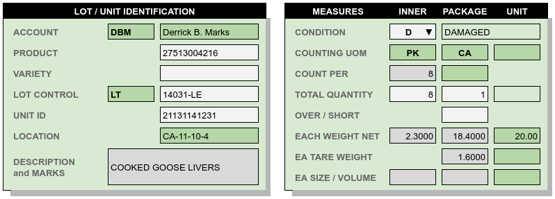

.. _transactions:

#############################
Document Lines Detail
#############################

Document lines provide the transactions for inventory control and location 
tracking. These lines contain identifying, control, descriptive, and 
quantitative information for each product, lot, and (optionally) storage unit 
in a facility.

A subset of document line columns is used for summary lines entry, as shown in 
the following view.

.. image:: _images/lines-1blank.png

The sumary document line entry uses product record default values for most 
values. When received goods require specific information different from 
these defaults, a document line detail view is required. 

Document line detail entry is divided into two sections: descriptive entries, 
and quantities. The following sections of this topic give examples of summary 
line entries, and corresponding detail entries which add to individual lines.

.. note::
   The summary and detail lines which follow use the following conventions:

   *  Yellow -- highlights summary lines which are selected for detail display.
   *  Dark Green -- indicates entries which are pulled from the Product, or 
      which could not be changed in this example. 
   *  When INNER UOM is left blank on a product, INNER quantities will not be 
      enterable on transaction lines.
   *  Dark Gray -- indicates default values which could have been changed if 
      need be, but were not changed in the displayed example.

Unit Weights and Measures
=============================

The classic individual unit entry is roll paper, where accurate unit weights and
measures are required for shipping and billing. Below is an entry lines list, 
where each roll has a unique foot linear measure and a unique net weight.

.. image:: _images/lines-2rolls.png

The details for one line are shown below. Every entry for the roll was
available in the summary line entry, and no changes were made in the detail. 
The roll net weight of 2611 Lbs, entered in the summary list view, is close to 
a default weight of 2616.38 lbs, calculated from the content value of .58 
lbs/ft.

Partial and Mixed Pallets
=============================

When goods are handled pallet-in, pallet-out, tracking mixed pallets may seem 
unnecessary. However, a number of circumstances result in mixed units or 
pallets in every warehouse:

*  Part of a unit may have damage. Damaged and whole goods must be listed with
   separate content lines.
*  If damaged content is replaced with make-up goods from a different lot, then 
   separate content lines are needed to track the two lots.
*  Pallet units may contain lot remainders transferred in from a production 
   line or even from another distribution center.
*  Multiple products may be shipped on mixed pallets to reduce shipping costs. 
   The warehouse may choose to lump the goods and not segregate them if picking 
   from mixed pallets is not problematic.
*  Inconsistent pallets may be received due to storage requirements in previous 
   warehousing. 
*  Stripping a floor-loaded container may result in a hand-full of remainders 
   for multiple products or lots, which get lumped on a mixed pallet.

We talk about not having mixed pallets when actually we do have them. 

By default, webWARES combines unit and content data in a single entry line. In
contrast, mixed pallet units start with a parent line that omits content values 
for **Product**, **Variety**, or Lot **Control**, but includes a required parent 
**UnitID**. (Without the **UnitID**, there would be no way to distinguish a 
mixed unit from a series of partial units.)

Subsequent child content lines will include **Product**, **Variety**, or Lot 
**Control** values, followed by the **UnitID**. Repeating the **UnitID** 
triggers the association of the mixed child content to the parent "unit only" 
line.

.. tip::
   In addition to sharing **UnitID** and **Location**, mixed unit and content
   lines have the same **LineKey** (see :ref:`cryptic-data`). Every document 
   line has an entry for **LineKey**, while the **UnitID** value is optional on
   other lines and is surely missing with bulk entries.

.. image:: _images/lines-3mixed.png

Repeating the **UnitID** causes the following changes to line detail values.

*  Child content **Location** is filled from the parent unit and protected.
*  **Count Per** on child content is cleared and protected; this does not apply 
   to mixed pallets.
*  Unit **Tare Weight** and unit **Quantity** are cleared and protected on child 
   content lines.
*  Entries for unit partial weights and partial measures are auto-calculated
   based on the content quantity, and these entries are filled and protected.

In addition, the parent unit line will have the following entries:

*  The unit **Quantity**, which is always filled/protected, will show "1". 
*  The unit **Tare Weight** will be taken from the product for the first child 
   content line.
*  The unit **Net Weight**, **Volume**, and **Quantity** entries will be the sum 
   of these entries from the child content lines.
*  The parent unit line entries for **Product**, **Variety**, and **Control**
   will be cleared and protected.

Detail for the highlighted line is shown below. Every entry but one, the 
**Condition**, came from either product default values or the summary line 
entry.

.. tip::
   There seem to be two entry procedures for lines, but actually:
   
   *  Entering two consecutive content lines with the same **UnitID** will 
      trigger a question, "Do these entries belong to the same unit? (Yes/no)." 
      Answering "Yes" will create the parent unit line and update the child
      content lines as described previously.
   *  Enterig a unit record without product content information, followed by
      child content records repeating the **UnitID**, will produce the same 
      result without having to ask the question.

Unit Tracking
=============================

Where each unit of a truck load is tied to unique information, the units must 
be entered separately in the lines summary. Values which make individual line 
entries necessary include varying **Lot Control** numbers and **Location**, 
individual **Unit ID**, and varying weights or measures per unit. An example 
truck load unit entry is shown in the following figure.

The details for the highlighted line are displayed to demonstrate the entries 
which commonly change from unit to unit. Each unit in the example has a unique 
**NetWeight**, for example. 

.. image:: _images/lines-4-detail.png

.. tip::
   Sometimes unique values are required for both **NetWeight** and 
   **GrossWeight**, but the program does not store gross weight. Since gross
   weight is by definition greater than net weight, entering gross weight in the 
   unit **TareWeight** field will calculate the **TareWeight** as the difference 
   between the two weights. Then the gross weight can be derived from the two 
   entries at any later time.

Bulk Versus Unit Entry
=============================

Many truck loads consist of 20 or more units, all uniform, to be stored in a 
single bay location and moved load-in load-out. The work of entering each unit
on a line is unnecessary in that case. In the previous example, if the units 
had been uniform, the load could have been entered as a single bulk line as 
shown below.

.. image:: _images/lines-5bulk.png

.. tip::
   On bulk entry lines, the line detail will show the unit count as the content 
   **Quantity** divided by the content **Count Per**, plus 1 for any remainder. 
   Where the content **Count Per** is blank, the unit count will be blank also.

Using Line Detail Entries
=============================

Line detail entries are necessary when entering unique values which are not 
visible in the summary. Specific cases where this might occur are listed here.

*  Damaged goods must be entered in separate content records which are marked 
   in the details.
*  Marks, variable descriptions, or special lot notes are entered in details.
*  Broken cases or sampled bags should be entered separately, noting the 
   shorted inner quantities.
*  Content count discrepancies on receiving are entered in the **Over/Short** 
   value, as positive or negative numbers. **Over/Short** applies to content 
   only, and only on receipt, where content is a visually countable quantity 
   (cartons, cases, bags, etc.).
*  Variable tare weights or gross weights are entered in the details view, 
   unlike consistent tare weights which are entered on the product setup.
*  When unit weight varies, linear counts or volumetric measures probably vary 
   too. This is especially important with hazardous materials, where both 
   weights and volume measures are used on the Bill of Lading.
*  **Account** is inherited from the document header for all positive-quantity
   lines (receipts and adjustments). An error is generated when a product 
   record matching the Account, Product, and Variety does not exist. 

   Shipments withdraw only from lots belonging to the document header account, 
   and shipment quantities are automatically negated.
*  Adjustments may withdraw from any lot regardless of the account in the
   document header, so that adjustments can effect ownership transfers.
   In ownership transfers, negative-quantity adjustment lines deduct lots from 
   a previous owner's account and positive lines add to the new owner's account 
   listed in the adjustment header.

   To enter an ownership transfer adjustment,the line details view is used to 
   choose the previous **Account** to deduct from, and then the product and lot. 
   When the account on a line does not match the document header account, the 
   subsequent line quantity entries will be negated, just as quantities are for 
   a shipment.

Document Line Requirements
=============================

Transactions are entered by line. The following rules apply to transactions:

*  Each line references a single product/variety, lot control, unit identifier, 
   and locator value.
*  Quantities are signed (+/-) to indicating the effect of the transaction on 
   inventory.
*  Lines contain either Reserved or On-Hand quantites, but not both. 
*  The document status and the data content of a line determine whether the 
   entry quantity will be Reserved or On-Hand.
*  A condition code is required for each entry line. The default is G(ood),
   see :ref:`condition-list`.

+------------------+----------+----------+----------+----------+----------+----------+
| Column Name      | Expected |  Inbound | Received | Reserved | Allocated|  Shipped |
+==================+==========+==========+==========+==========+==========+==========+
| SEQUENCEKEY [2]_ | sequence | sequence | sequence | sequence | sequence | sequence |
+------------------+----------+----------+----------+----------+----------+----------+
| UNITIDENTIFIER   |          |     [3]_ |     [3]_ |          |     [3]_ |     [3]_ |
+------------------+----------+----------+----------+----------+----------+----------+
| TRANSACTIONTYPE  |   3 or 5 |   3 or 5 |   3 or 5 |   4 or 5 |   4 or 5 |   4 or 5 |
+------------------+----------+----------+----------+----------+----------+----------+
| TRANSACTION [1]_ | (header) | (header) | (header) | (header) | (header) | (header) |
+------------------+----------+----------+----------+----------+----------+----------+
| LINEKEY     [2]_ | sequence | sequence | sequence | sequence | sequence | sequence |
+------------------+----------+----------+----------+----------+----------+----------+
| STATUS           |        1 |        2 |       3+ |        1 |        2 |       3+ |
+------------------+----------+----------+----------+----------+----------+----------+
| POSTDATE         |      now |      now |      now |      now |      now |      now |
+------------------+----------+----------+----------+----------+----------+----------+
| LOCATION         |          |          | directed |          |   (unit) |   (unit) |
+------------------+----------+----------+----------+----------+----------+----------+
| ACCOUNT          | (header) | (header) | (header) | (header) | (header) | (header) |
+------------------+----------+----------+----------+----------+----------+----------+
| PRODUCT          | required | required | required | required | required | required |
+------------------+----------+----------+----------+----------+----------+----------+
| VARIETY          | required | required | required | required | required | required |
+------------------+----------+----------+----------+----------+----------+----------+
| CONTROLCODE      |          | required | required |          |   (unit) |   (unit) |
+------------------+----------+----------+----------+----------+----------+----------+
| CONTROL          |          | required | required |          |   (unit) |   (unit) |
+------------------+----------+----------+----------+----------+----------+----------+
| DESCRIPTION      | [product]| [product]| [product]| [product]| [product]| [product]|
+------------------+----------+----------+----------+----------+----------+----------+
| CONDITION        |          |          | required | required |   (unit) |   (unit) |
+------------------+----------+----------+----------+----------+----------+----------+
| UNITUOM          | (product)| (product)| (product)| (product)| (product)| (product)|
+------------------+----------+----------+----------+----------+----------+----------+
| UNITNET          | [product]| [product]| [product]| [product]|   (unit) |   (unit) |
+------------------+----------+----------+----------+----------+----------+----------+
| UNITTARE         | [product]| [product]| [product]| [product]|   (unit) |   (unit) |
+------------------+----------+----------+----------+----------+----------+----------+
| UNITSIZE         | [product]| [product]| [product]| [product]|   (unit) |   (unit) |
+------------------+----------+----------+----------+----------+----------+----------+
| UNITSTACK        | [product]| [product]| [product]| [product]|   (unit) |   (unit) |
+------------------+----------+----------+----------+----------+----------+----------+
| CONTENTUOM       | (product)| (product)| (product)| (product)| (product)| (product)|
+------------------+----------+----------+----------+----------+----------+----------+
| CONTENTONHAND    |          |          | required |          |          | required |
+------------------+----------+----------+----------+----------+----------+----------+
| CONTENTRESERVE   | required | required |          | required | required |          |
+------------------+----------+----------+----------+----------+----------+----------+
| CONTENTNET       | [product]| [product]| [product]| [product]| [product]| [product]|
+------------------+----------+----------+----------+----------+----------+----------+
| CONTENTTARE      | [product]| [product]| [product]| [product]| [product]| [product]|
+------------------+----------+----------+----------+----------+----------+----------+
| CONTENTSIZE      | [product]| [product]| [product]| [product]| [product]| [product]|
+------------------+----------+----------+----------+----------+----------+----------+
| OVERSHORT        |          |          |          |          |          |          |
+------------------+----------+----------+----------+----------+----------+----------+
| INNERUOM         | (product)| (product)| (product)| (product)| (product)| (product)|
+------------------+----------+----------+----------+----------+----------+----------+
| INNERONHAND [4]_ |          |          | [product]|          |          | [product]|
+------------------+----------+----------+----------+----------+----------+----------+
| INNERRESERVE [4]_| [product]| [product]|          | [product]| [product]|          |
+------------------+----------+----------+----------+----------+----------+----------+
| INNERWEIGHT [4]_ | [product]| [product]| [product]| [product]| [product]| [product]|
+------------------+----------+----------+----------+----------+----------+----------+
| INNERSIZE   [4]_ | [product]| [product]| [product]| [product]| [product]| [product]|
+------------------+----------+----------+----------+----------+----------+----------+

.. [1] TRANSACTIONTYPE and TRANSACTION numbers are copied from the document
       header.
.. [2] A LINEKEY is assigned to track posting to a product/variety/control lot 
       combination on reserved quantities. Where unit identifiers are required, 
       and the quantity is on-hand, then LINEKEY is programmatically expanded 
       to unique SEQUENCEKEY entries for each unit transaction line. 
.. [3] UNITIDENTIFIER entries are not required to be unique. Unit numbers repeat
       where skids which are sequentially numbered 1, 2, ... in a production 
       batch, or where materials are loaded on prenumbered reusable skids in a 
       closed manufacturing environment. 
       Where goods are fungible, UNITIDENTIFIER entries are not even required.
.. [4] If a product INNERUOM is null, associated INNER entries are prohibited. 
       Otherwise, INNERWEIGHT and INNERSIZE default to product values.

.. note::
   #. (header), (product), and (unit) **parentheses** indicate values copied
      from the respective source without change.
   #. [product] **brackets** indicate the source of a default value.

.. warning::
   Inbound units can be reserved by outbound shipments. Upon receipt a reserved
   unit might be unavailable due to condition. A method for resolving this 
   quandry is required.

.. _cryptic-data:

Line Data not Displayed
=============================

Some document line data may not be included in a view, but is required for
program operation. These columns are described in the following list.

*  **SequenceKey** -- The program assigns a unique key to each document line.

*  **TransactionType** and **Transaction** -- are required back references
   from the document header, and these columns organize lines in lot or location 
   detail displays.

*  **LineKey** -- is necessary to maintain the original document structure for 
   for shipping and receiving documents. Pick tickets are presented with lines 
   sorted by Location, but Warehouse Receipts and Bills of Lading are sorted in 
   the original document order, that is, by **Linekey**.

   **LineKey** tracks the initial entry sequence of unit lines in a document:

      `LINEKEY = ( TRANSACTION * 1000 ) + LINEPOS`

   Where units (pallets) with mixed lots are received or shipped, or where 
   fungible order quantities are expanded to be filled by multiple unit picks, 
   several transaction lines with unique **SequenceKey** and varying 
   **Location** entries may have the same **LineKey**.

*  **Status** -- is determined from assigning unit numbers when unit tracking 
   is used, from picking, staging and loading activities, and from releasing 
   completed documents, applying charges, and inviocing.

*  **PostDate** -- is copied from the transaction header and applies to all
   lines in a document. The **Postdate** of a document should be finalized at 
   the date and time that the warehouse signs a receipt or a carrier signs for 
   a shipment.

*  **ContentOnHand**, **InnerOnHand**, **ContentReserve**, **InnerReserve** --
   The user interface shows Content and Inner Quantities, but these quantities 
   are actually represented in the data as either **_Reserve** or **_OnHand** 
   depending on the line status. The appearance of a single data field is 
   deceptive from the standpoint of data definition.

*  **UnitUOM**, **ContentUOM**, and **InnerUOM** -- are display-only values 
   copied from the current product record.

Document Lines Column Data
=============================

Documentation resources include the data column definitions for :ref:`lot-lines`.
