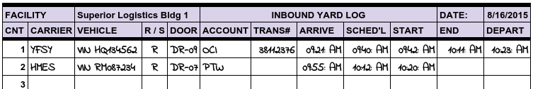
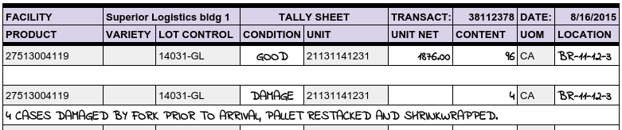

.. _receiving:

#############################
Receiving Procedures
#############################

Receiving goods in a warehouse involves a sequence of steps which should be 
recorded in the warehouse logs and information system. Failing to perform these 
steps in record keeping will result in information errors, inventory mistakes, 
billing omissions, and in some cases, liability for the cost of entire loads. 
It is not an exageration to say that bad receiving practices constitute 
negligence on the part of a warehouse operator. To avoid receiving problems and 
corresponding liabilities, follow the steps in this article. 

Maintain a Yard Log
=============================

Check in each incoming and outgoing vehicle with a yard log which includes:

*  **Carrier** -- The SCAC or other identifier of the vehicle's owner. 
*  **Vehicle** -- One or more identifiers for the vehicle and driver.
*  **Purpose** -- An indicator of (R) Receiving or (S) Shipping purpose. 
*  **Location** -- The dock door location assigned for loading or unloading. 
*  **Account** -- The customer account for the visit. 
*  **Transaction** -- The assigned receipt or shipment sequence number. 

Additionally, activity dates and times should be recorded:

*  **Arrived** -- When the vehicle is admitted to the yard. 
*  **Scheduled** -- When loading/unloading is scheduled to begin.
*  **Starting** -- The time when the warehoue and vehicle doors are opened.
*  **Ending** -- The time when the vehicle doors are closed.
*  **Departed** -- When the truck leaves the facility yard.

Transaction documents share some information with the Yard Log, of course. But 
if a receipt is posted without a corresponding yard log entry, or if a truck 
is unloaded without entering a receipt, then a serious error has occurred. 

Use a Receiving Tally
=============================

As a standing procedure, the paperwork for a load should go directly to the 
receiving clerk when a vehicle arrives. Dock and vehicle doors should not be 
opened until the paperwork is entered in the information system and a receiving 
tally is prepared. This tally form should list the products and units to be 
received, but with blanks for the quantities and locations.

Photographic Evidence
=============================

Inspect the contents of a vehicle immediately once the doors are open. If goods 
have shifted in transit or there is any other reason to suspect damage, 
photograph the load in place. (Some warehousers photograph every load no matter 
what.) If a condition issue is discovered while unloading, as in the tally sheet 
above, stop and document the situation with photographs.

When stripping containers, unload, lump, and segregate the products onto pallets 
and prepare a tally of exact counts per pallet unit. When unloading palletized 
product, count the top tier on each pallet to verify that the extended count 
for the pallet is correct. Remember. not every driver is sober and honest.

Locate Products in Storage
=============================

As a general rule, received products should be put away in the front third (the 
"A" section) of the warehouse. Goods which overstay their welcome there should 
be rewarehoused periodically to keep space available. If possible, products 
should be segregated by account. Hazardous material must be stored in areas
separated from general storage by bulkhead walls. Food products must be stored 
away from walls and surrounded with a painted clean zone, among other 
requirements. 

Knowing that there are rules for storage, the warehouse should be zoned and the 
correct zone for storing a product should be checked before putting the goods 
away. 

Verify Receiving From Tally
=============================

When a tally is complete, it should go directly to the receiving clerk for 
checking and updating. The clerk should check the following: 

#. Hash total of number of received units is correct. 
#. Hash total of content (cases, boxes, cartons, etc.) matches. 
#. Condition of goods is noted correctly. 
#. Storage zone and location is appropriate for warehouse, account, and product. 

The following items must be entered to complete the receiving process. 

#. The storage location of each lot or unit must be updated. 
#. Add separate line entries for goods with non-conforming conditions. 
#. Add accessorial charges for any exceptional services. 

In the receiving tally shown previously, a separate line entry is required for 
the damaged cases. Damaged cases are stored with the original pallet, but the 
pallet requires hand restacking to place the damaged cases on the top tier. 
This entails three charges: one for hand stacking, another for shrinkwrap, and 
a third charge for mixed pallet tracking. 

End-of-Day Reconciliation
=============================

At the end of each day, warehouse clerical personnel must verify that the line 
count of inbound vehicles on the yard log matches the number of receiving 
tallies and entered receipts. 

Then standard receiving charges for storage and handling should be calculated 
for receipts. Then the daily charges log for receipts would be printed and 
checked for errors. A billing error, such as a receipt with $25,000.00 in 
charges, is likely due to an overlooked entry error. Fix any errors immediately.

Issuing Warehouse Receipts
=============================

Once billing is calculated and checked, Warehouse Receipt documents should be 
printed, signed, and issued, either as invoices or just as documents, per 
account preferences. Failure to issue warehouse receipts is negligence on the 
warehouser's part. Warehouse Receipts satisfy the following business needs:

*  The receipt establishes the warehouse's lien for services, allowing the 
   warehouse to require payment before releasing goods from bailment. For this 
   to be effective, the rates for storage and handling must be printed.
*  The Warehouse Receipt document includes contractual terms which are enforced 
   based on the customer's deposit of goods and acceptance of the receipt. This 
   requires that the contract terms backer be a part of the receipt document.
*  The receipt establishes a limitation of warehouse liability for negligence. 
   This limitation is based on the liability limitation from the warehouse 
   setup, or a separate declaration of value on the account setup.
