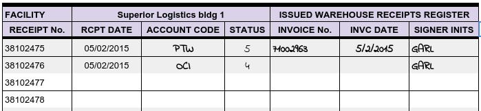
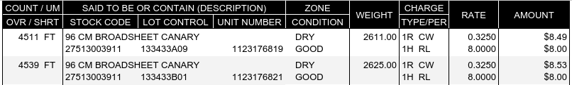
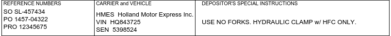

.. _receipts:

#############################
Warehouse Receipts
#############################

Warehouse Receipt documents should be printed, signed by the warehouse manager, 
and issued to the customer. Under the law a warehouser is not required to 
issue receipts, but courts have ruled that:

   *"... a failure to issue or deliver such receipt constitutes negligence on 
   the part of the warehouseman for which he may be held liable for any loss 
   occasioned thereby to the depositor."* [1]_

Therefore, every warehouser needs to issue receipts at all times, and to be 
certain that these documents satisfy his legal responsibilities.

Terms Required by the U.C.C.
=============================

The warehouser's legal responsibilities are stated in the Uniform Commercial 
Code (U.C.C.) Section 7-202(2):

   Unless a warehouse receipt embodies within its written or printed terms
   each of the following, the warehouse is liable for damages caused by the
   omission to a person injured thereby:

   a) the location of the warehouse where the goods are stored;
   b) the date of issue of the receipt;
   c) the consecutive number of the receipt;
   d) a statement whether the goods received will be delivered to the bearer, 
      to a specified person, or to a specified person or his order;
   e) the rate of storage and handling charges, except that where goods are 
      stored under a field warehousing arrangement a statement of that fact is
      sufficient on a non-negotiable receipt;
   f) a description of the goods or of the packages containing them;
   g) the signature of the warehouseman, which may be made by his authorized
      agent;
   h) if the receipt is issued for goods of which the warehouseman is the 
      owner, either solely or jointly in common with others, the fact of such 
      ownership; and 
   i) a statement of the amount of advances made and of liabilities incurred 
      for which the warehouseman claims a lien or security interest 
      (Section 7-209). If the precise amount of such advances made or of such 
      liabilities is, at the time of the issue of the receipt, unknown to the 
      warehouseman or to his agent who issues it, a statement of the fact that 
      advances have been made or liabilities incurred and the purpose thereof 
      is sufficient. [2]_

So a warehouser is not required to issue receipts, and receipts do not have to 
contain particular terms, but failure to issue receipts including the preceding 
terms makes the warehouser laible in any disputes involving those omissions.

Warehouse Receipt Documents
=============================

Issuing Warehouse Receipts is a fundamental aspect of warehousing by which the 
warehouser protects his own interests and notifies the customer of the shared 
obligations for care of goods. 

In this context, the WARES program provides automated steps to issue receipt 
documents which meet legal requirements as stated previously. The document form 
used by WARES may be viewed here: :ref:`warehouse-receipt`.

U.C.C. Required Elements
=============================

a. Warehouse Buildings
-----------------------------

The top line of the receipt states the operating name of the warehouse company,
with the physical location of the warehouse storage building stated below that.

.. image:: _images/receipt-a-b-c.png

b. Consecutive Receipt Number
-----------------------------

To guarantee that every receipt is actually issued, the warehouse manager should 
maintain a hand register of the consecutive numbers when signing receipts. A 
portion of a sample hand register of consecutive receipts is shown following: 

When using a receiving document to update inventory without issuing a receipt, 
the consumed numbers should be noted in this register as either balances posted 
into history, such as inventory starting balances (UNISSUED), or as transactions 
entered in error and then deleted (VOIDED). (Unissued and voided documents are 
maintained in the WARES database for reference.)

c. Receipt Issue Date
-----------------------------

To the right of the warehouse building is the consecutive number of the receipt,
with the date of receipt below. The receipt date is taken from the date and time 
that the receipt is completed and authenticated by warehouse personnel.

d. Delivery Orders
-----------------------------

Where standard terms must be expressed, the language is pre-printed on the face 
of the warehouse receipt. This includes the agreed delivery terms for the 
warehouse, as required in U.C.C. item (d).

.. _receipt-d:

.. image:: _images/receipt-d.png

e. Storage and Handling Rates
-----------------------------

Typically storage and handling rates do vary from customer to customer, and the 
rates may vary from product to product within a customer. Therefore rates are 
listed for each received product, as shown in the following figure:

.. _receipt-e-f-i:

WARES uses code **1R** to represent *Receiving Storage* and code **1H** for
*Receiving Handling*. This example shows industry recognized unit of measure 
codes **CW** for *Hundredweight* and **RL** for *roll* to complete the rate
extension. (The warehouse may also charge minimum fees, or a storage fee may be 
prorated, in which case rates do not extend to the amount column.) 

f. Description of Goods
-----------------------------

The description of goods includes the textual name, identifiers and marks, and 
counts and weights. 

g. The Warehouser's Signature
-----------------------------

The warehouse manager or his authorized agent should sign every warehouse 
receipt, and receipts should be recorded in the receipt register as they are 
issued.

.. _receipt-g-h:

.. image:: _images/receipt-g-h.png

i. Statement of Liabilities
-----------------------------

Rates are known when the warehouse receipt is finalized, and so the extension 
of the rates and a total of the liabilities (charges due) is part of the 
receipt. The text in section (d) above also clarifies that the warehouse lien 
covers this receipt and any charges due from the customer on other accounts.

Other Receipt Terms
=============================

Other parts of the law and court decisions based on it extend the warehouser's 
responsibilities beyond the previously stated requirements. In general, a 
warehouser is expected to care for deposited goods using the actions of a 
reasonable person who is capable in his job, who is generally knowledgeable 
(about warehousing), knows the legal requirements, and is fair-minded. [3]_

In return, the warehouser may contract for certain rights. The receipt must 
include information relevant to these rights, so that the warehouser can 
receive these benefits. 

a. Received Condition
-----------------------------

The warehouser is responsible for the quantity and condition of goods once 
received. Overages, shortages, and damage which exist when goods are received 
must be noted on the receipt, as shown by titles in the 
:ref:`Product Itemization<receipt-e-f-i>`.

b. Storage Type Zone
-----------------------------

Warehouse locations should be zoned to match the goods in storage, and these 
zones must be specific enough to prevent mistakes. For example, it is not enough 
to use zones COOL and FROZEN in refrigeration. If frozen goods include both ice 
cream and dog food then ice cream can be in a general freezer. But anyone 
operating a freezer should know that dog food requires a separate PETFOOD room 
and zone.

c. Customer Instructions
-----------------------------

A warehouser may know to separate ice cream from dog food, but many products 
have storage and handling requirements which are too esoteric to be generally 
known. The customer needs to supply these instructions with each shipment, and 
the specific cautions should be acknowledged on the receipt, shown in **SPECIAL 
INSTRUCTIONS** below:

d. Reference Information
-----------------------------

Cross-reference information allows the customer to correlate a warehouse receipt 
with his own records, his supplier, and the carrier, as shown above.

e. Warehouser's Lien
-----------------------------

A warehouse may impose a lien for services, so the warehouse may demand payment 
before releasing goods from bailment. The :ref:`Warehouser's Lien <receipt-d>` 
is effective only if the rates for calculation and the 
:ref:`Amount Due<receipt-g-h>` are displayed on the receipt.

f. Limitation of Liability
-----------------------------

The receipt establishes a limitation of warehouse liability for negligence, 
which is taken from the warehouse setup or derived from a declaration of value 
on the account setup. This :ref:`Liability Limitation<receipt-d>` is printed in 
red in the example receipt.

View the full warehouse receipt of this example here: :ref:`receipt-example`.

Industry Contract Terms
=============================

There are several trade associations for public warehousing, with principal ones 
being the **International Association of Refrigerated Warehouses** (IARW) and 
the **International Warehousing and Logistics Association** (IWLA). These groups 
have promulgated standard contract terms for members to use. Familiarity with 
these terms is expected of corporate logistics personnel, so warehousers who 
adopt these standard terms can conduct business without recourse to expensive,
and frequently faulty, legal representation.

Versions of these Standard Terms are posted here for reference:

:ref:`terms-iarw`

:ref:`terms-iwla`

.. warning::
   **Disclaimer**: AAltsys Technology displays these terms as example documents 
   commonly used in public commerce. AAltsys is not qualified to judge the 
   accuracy, usability, or legal virtue of these terms (and we are certainly not 
   responsible for the sexist nature of their language). The presentation of 
   these terms does not constitute permission to use the same without 
   authorization from the sponsoring organizations.
 
-----

.. rubric:: Footnotes

.. [1] William H. Towle, *Warehousing Law* (Oak Park, IL: Cawley Press, Ltd., 
       1988), 5.
       
.. [2] ibid, 6.

.. [3] https://en.wikipedia.org/wiki/Reasonable_person.
