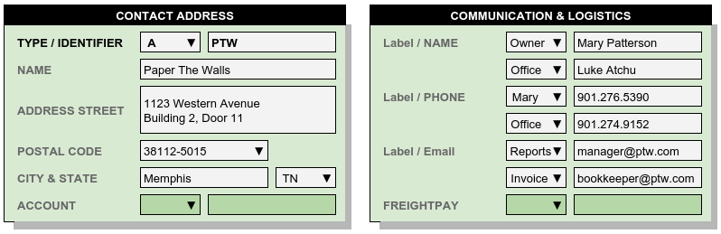
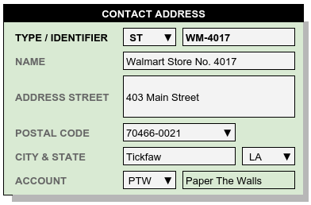
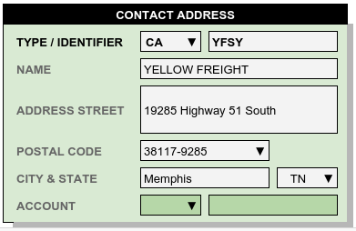

.. _fac-contacts:

#############################
Using Entity Contacts
#############################

All name and address information for entities in WARES is stored in the Contacts
database table. This makes **Contacts** management a fundamental part of the 
technology in WARES. A Typical Contact record may contain four types of 
information: an entity name, an address, communication entries for email, 
phone, and so forth, and freight configuration options.

A **Type** code prefixes each **Contacts** identifier, and the **Type** 
determines how the contact is used by the program. The default Type code list 
may be viewed at :ref:`contacts-list`. In the following sections, **Type** 
codes are used to ...

Facilities and Accounts
=============================

General accounting programs usually fail to allow for the variety of address 
and contact entities which a company must use. The need for multiple special 
addresses is especially true for logistics services, where shipping, billing, 
and administrative functions are frequently managed from separate locations.

Facility Setup Addresses
-----------------------------

Each warehouse facility master Company record contains links to several Contact
addresses. These addresses are typically entered once when the facility is 
first configured, but that may be changed later as required. Facility Contact 
types and addresses are: 

+-------+----------------------------------------------------------------+
| Code  | Description                                                    |
+=======+================================================================+
| C     | The Company general mailing address                            |
+-------+----------------------------------------------------------------+
| F     | The Company communication record (email, phone, etc.)          |
+-------+----------------------------------------------------------------+
| ST    | The Company general package receiving address                  |
+-------+----------------------------------------------------------------+
| BT    | The Company Bill To address, Used for Payables                 |
+-------+----------------------------------------------------------------+
| RI    | The Company remittance address, printed on invoices            |
+-------+----------------------------------------------------------------+
| B     | A Company warehousing operations facility address              |
+-------+----------------------------------------------------------------+

Each of these contact types, if present, will provide unique address data for 
the purpose specified. If a type is omitted, the address will default to the 
general company address with type code **C**.

Account Setup Addresses
-----------------------------

Warehouse Accounts, or customers, may use Contact addresses as follows:

+-------+----------------------------------------------------------------+
| Code  | Description                                                    |
+=======+================================================================+
| A     | The Account general mailing address and communication record   |
+-------+----------------------------------------------------------------+
| ST    | The Account general package receiving address                  |
+-------+----------------------------------------------------------------+
| BT    | The Account Bill To address, Used for Receivables              |
+-------+----------------------------------------------------------------+
| PF    | The Account Pays Freight address for Prepaid Bills of Lading   |
+-------+----------------------------------------------------------------+

Contact types listed above provide account addresses for specific purposes. 
When an account contact type is omitted, the address used will default to the
general account address with type code **A**.

Entering Account Addresses
-----------------------------

Account address and contact information is usually entered when setting up a 
new account, and it is updated as neccessary on instruction from the client. 
Each account Contacts record uses the **Account** identifier, but with varing 
**Type** code entries to distinguish the separate records. An example account 
address record is shown below.

Account linking entries and Freight Payment codes are not used and not entered 
for addresses associated with a warehouse customer account, or with warehouse 
facility records either.

Ship-From and Ship-To Addresses
===============================

Warehouses produce authoritative logistics documents for warehouse receiving 
services and for outbound shipping. Each document may contain several addresses 
to satisfy all the document requirements. These addresses, many of which were 
mentioned previously, are given in the following two tables.

Receiving Logistics Documents
-----------------------------

A Warehouse Receipt document may include the following addresses:

+-------+----------------------------------------------------------------+
| Code  | Description                                                    |
+=======+================================================================+
| ST, B | The receipt destination point, or warehouse building address   |
+-------+----------------------------------------------------------------+
| SF, VN| The shipped from origination point or vendor address           |
+-------+----------------------------------------------------------------+
| A     | The Account general mailing address and communication record   |
+-------+----------------------------------------------------------------+
| C, RI | The warehouse company remittance address, if invoiced          |
+-------+----------------------------------------------------------------+

Shipping Logistics Documents
-----------------------------

In Third-Party logistics, the Bill of Lading should present the following four 
addresses:

+-------+----------------------------------------------------------------+
| Code  | Description                                                    |
+=======+================================================================+
| SF, B | The shipment origination point, or warehouse building address  |
+-------+----------------------------------------------------------------+
| A     | The Account general mailing address and communication record   |
+-------+----------------------------------------------------------------+
| ST    | The shipment consignee or receiving address or location        |
+-------+----------------------------------------------------------------+
| PF    | The Freight Payor's address, based on freight payment terms    |
+-------+----------------------------------------------------------------+

Most of these addresses are defined during Facility setup and Account entry, 
with the exception of Ship-From and Ship-To contacts. Where goods come from, 
and where they are going to, may have to be entered for each receipt or 
shipment. An example **Ship-To** contact record is shown below.

This Contact is linked to the **Account** associated with the inventory, and 
if necessary, a **FreightPay** code may be entered to override Account settings.

Other Contact Entity Names
=============================

Additional Contact entity types are used throughout WARES, as listed in the 
following table.

+-------+------------------------------------------+---------------------+
| Code  | Description                              | Where Used          |
+=======+==========================================+=====================+
| B     | Warehouse building address               || Warehouse Receipts |
|       |                                          || Bills of Lading    |
+-------+------------------------------------------+---------------------+
| E     | Warehouse Employee Name                  | Activity tracking   |
+-------+------------------------------------------+---------------------+
| T     | EDI Trading Partner                      | Data Exchange       |
+-------+------------------------------------------+---------------------+
| CA    | Freight Carrier                          || Warehouse Receipts |
|       |                                          || Bills of Lading    |
+-------+------------------------------------------+---------------------+

Of these Contacts, the Freight Carrier is most likely to need to be entered
apart from Facility setup and Account entry. An example carrier Contact is 
displayed here.

Contacts Database Schema
=============================

The Contacts database column schema can be found at :ref:`contacts-schema`.

 
