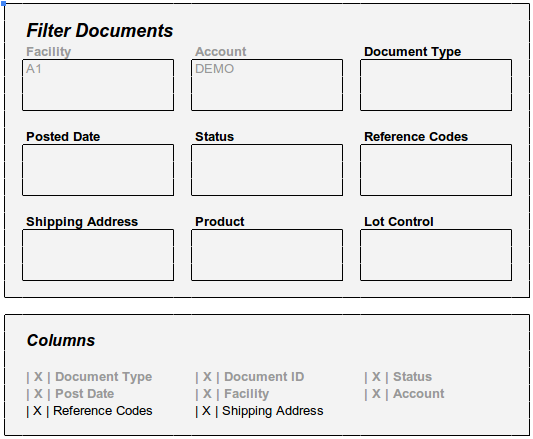
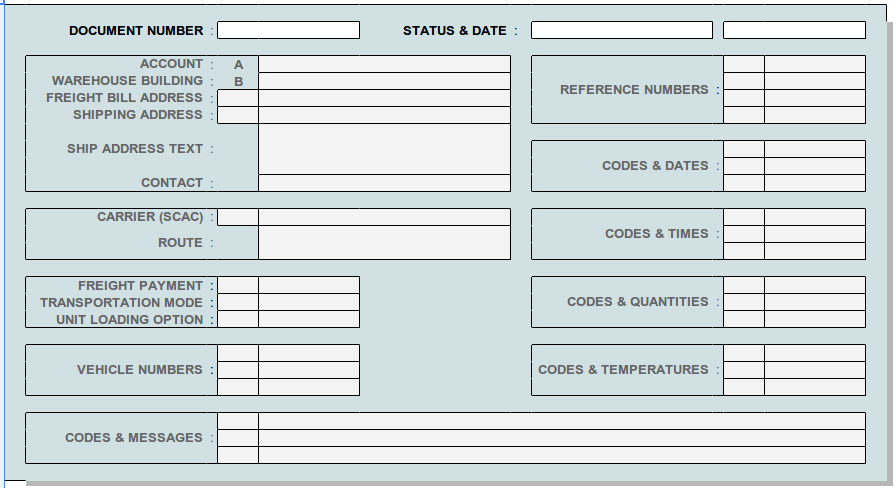
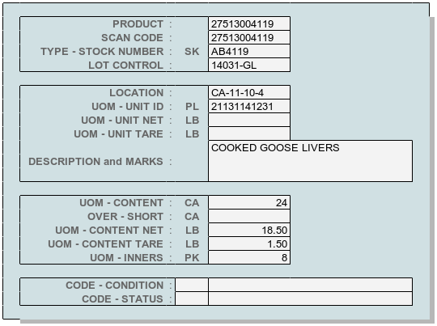

.. _loc-documents: 

#############################
Locator Documents
#############################

WARES documents of all types have a common structure and are maintained in a 
master documents table. Source documents can be selected and reviewed by 
clicking the document number link on a locator item, or by using the locator 
**Documents** view page. 

.. note::
   #. The term **Document** refers to heading information for a group of 
      inventory transaction lines applied together.
   #. Each document has a unique type, listed at :ref:`codes:type-list`.

Documents Filter
=============================

Document filter selections include facility, account, document type, status, 
date or date range, reference, shipping address id (and product, and lot).
The Documents filter page is shown following.

.. Tip::
   Product and Lot Control entries are part of transaction lines, not documents. 
   At least initially, these entries are not included in the documents filter.

Document View
=============================

Within the locator, document references link to source documents which are 
viewed as forms to be printed or downloaded.  Document views in the locator are 
read-only. A generic view of document heading information is shown following.

Transaction Lines
=============================

Each document includes one or more lines of inventory transactions. From the 
list of lines, individual line detail may be displayed as shown following.

