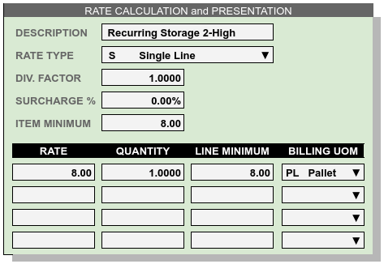

.. _rates:

#############################
Defining Rates for Charges
#############################

Rate Overview
=============================

Rate records define charges for the warehouse services which are invoiced to 
customers. A charge cannot be applied to an activity, a transaction, or a bill 
without a rate record defining the charge. 

WARES rate definitions allow a company to bill all types of services according 
to standard industry practices. When writing a proposal or contract, enter 
proposed rates here to verify that the quote will be consistent with industry 
norms and can be implemented as intended within the WARES software. 

Warehouse services are defined by the company :ref:`services`. Each rate 
relates to eactly one service code.

Scope and Grouping of Rates 
=============================

Rates are grouped and the type of group affects the scope of a rate. Any one 
service code can appear only once in a group. All rates in a group will have 
the same account entry. If the account entry is left blank on a rate group, 
those rates can be applied to any account. If the account entry is filled, the 
rates will be restricted to the specified account.

Many rate records may refer to the same service code, and an account may have 
more than one rate for a service, provided the rates are in separate groups. 

*  Rates in the **GLOBAL** group apply across all accounts, and the account 
   entry for GLOBAL rates is null and protected. The GLOBAL group sets default 
   rates for the company.
*  Rates gouped by **account** identifier apply to only one customer account, 
   and the account entry of these rates is filled with the account identifier 
   and protected. 
*  Rates may be assigned a **group** code other than an account identifier or 
   GLOBAL. The account entry, which may be null, must be the same for all rates 
   in the group. 

A group rate for a service will override a corresponding GLOBAL rate with the 
same service code, and account-associated rates and groups will override rates 
which are not assigned to accounts. 

Grouped rates are particularly inportant for calculated charges, specifically 
storage and handling. As an example, there should be different storage rates 
for cartons on pallets stacked 3 high than for supersacks stacked 2 high. This 
would require two separate rate groups associated with the account. Typically 
each rate group would include the calculated storage and handling service codes 
for a group of products which are billed the same.

Another warehouse stores imported Boxed Boneless Beef. These goods are brokered 
or traded while in the warehouse, so product is transferred between accounts. 
The warehouse creates group **BBB** for the calculated rates on this product, 
leaving the account identifier blank for the group. Every owner of the product 
shares the same calculated storage and handling rates. 

The scope of a rate may be restricted to specific activities. For example, 
receiving handling rates should be applied to warehouse receipts only, copying 
and long-distance FAXing fees might apply to receiving and shipping, and extra 
labor might be required on any documented activity. 

Applying Rates
=============================

A rate is used to apply charges in one of four ways:

*  **Repeating** rates may create separate charge entries according to a 
   calendar schedule. Repeating charges have fixed rates and quantities, so 
   the charge is always the same. See billing documentation for more 
   information.
*  **Calculated** rates apply storage and handling charges to products on
   warehouse receipts and optionally shipments (for outbound handling), and to
   calculate charges for recurring product balances.
*  **Mandatory** rates may create charges on any documents, with calculation 
   quantities based on a broad range of options. For example, a document fee 
   could be applied by transaction for every shipment, while a line pick fee 
   might be applied for every line item after the third one.
*  **Optional** rates are used to apply charges where either the occurrence, the 
   quantity, or the rate cannot be determined programmatically. As an example, 
   a charge for replacing a pallet shell and restacking goods would be optional, 
   as this activity cannot be anticipated.

Only optional rates can be used when entering charges on activities, as all 
other rates are applied by billing calculation. Optional charges must be entered 
on documents prior to performing calculated billing.

Setting Up Rates
=============================

The Rate Setup page is divided into three sections: Identifying Information, 
Calculation Entries, and repeating calendars. Calendars are described 
separately in the billing documentation.

.. image:: ../billing/_images/rates-id.png

Identifying entries:
-----------------------------

Identifying entries specify the rate grouping, the service to be performed, 
the account association, and the activity and billing scope of the resulting 
charges.

+-----------------+----+-------------------------------------------------------+
| Entry           | M  | Permissible Identifying Entries                       |
+=================+====+=======================================================+
| Rate Group      | M  | GLOBAL, an  account identifier, or a grouping code    |
+-----------------+----+-------------------------------------------------------+
| Service Code    | M  | Selected from the list of warehouse service codes     |
+-----------------+----+-------------------------------------------------------+
| Applied         | M  | (R)epeating, (C)alculated, (M)andatory, or (O)ptional |
+-----------------+----+-------------------------------------------------------+
| Account         |    | A customer account, or left blank for shared groups   |
+-----------------+----+-------------------------------------------------------+
| Activity        |    | A code for a documented activity or transaction       |
+-----------------+----+-------------------------------------------------------+
| Per Code        |    | Code referencing quantity  from transaction activity  |
+-----------------+----+-------------------------------------------------------+
| Quantity Method | O  | Method reference for calculating charge quantity      |
+-----------------+----+-------------------------------------------------------+
| Payer Method    | O  | Method to determine customer to invoice for charge    |
+-----------------+----+-------------------------------------------------------+

Rates are uniquely identified by the combination of a **Rate Group** and a 
**Service Code**. The **Rate Group** entry can be either the word GLOBAL, an 
account identifier, or a user-defined rate group. 

**Service Code** must be selected from the company's :ref:`services-list`.

Service codes determine which rates **Apply** as Calculated or Repeating, and 
the **Apply** code is filled and protected accordingly. Other rates should be
set to Optional or Mandatory, depending on whether user entry is required to 
determine a charge. 

Optional rates are applied through user entry, while charges for mandatory 
rates are created by billing calculations. Calculated rates are applied through 
special routines. Finally, Repeating rates create charge records and accumulate 
charges based on the repeating rate's calendar schedule. Each repeating rate is
associated with acalendar entry keyed by the rate's **Group** and **Service**.

The **Account** entry is null for GLOBAL rates, filled with the account code 
for rates in an account group, and otherwise either attached to an account or
blank (shared) for user-defined groups. 

Each rate may restricted to apply to one or more transactional activities. Each 
activity has a **Per** code to identify the quantity calculation for the rate, 
and optional references to calculation methods for quantity and/or payer 
to invoice for the charge.

Calculation entries
-----------------------------

These entries determine the content of charge line detail.

+---------------+---+------------------------------------------------+--------+
| Entry         | M | Billing Information Entry                      | Default|
+===============+===+================================================+========+
| Description   | M | Information shown on charges and invoices      | (code) |
+---------------+---+------------------------------------------------+--------+
| Rate Type     | M | Rate types: Single, Quantity, Measure, or Tier | S      |
+---------------+---+------------------------------------------------+--------+
| Factor        | M | Numerical quantity divider for unit conversion | 1.0    |
+---------------+---+------------------------------------------------+--------+
| Surcharge     |   | Percentage charge multiplier for tax or other  | null   |
+---------------+---+------------------------------------------------+--------+
| Item Minimum  |   | Minimum total charge amount on an activity     |        |
+---------------+---+------------------------------------------------+--------+
| Rate          |   | The charge per unit of service, may be tiered  |        |
+---------------+---+------------------------------------------------+--------+
| Quantity      | M | Starting quantity to apply this rate tier      | 1.00   |
+---------------+---+------------------------------------------------+--------+
| Line Minimum  |   | Minimum amount for charge entry in tier        | Q * R  |
+---------------+---+------------------------------------------------+--------+
| Billing UOM   | M | Informational UOM used on charges and invoices |        |
+---------------+---+------------------------------------------------+--------+

*  The rate **Description** entry is the actual invoice description for  
   calculated, mandatory, and repeating charges. This is the default charge 
   description for user-entered optional charges. 
*  **Rate Type** sets whether the rate will have a (S)ingle line, or if multiple 
   rates form a table based on either (Q)uantity or (M)easure, or if a rate 
   has (T)ier levels with corresponding minimums and rationality checks. 
*  A **Factor** will divide the quantity in a charge to convert from inventory
   quantity to billing quantity. For example, the factor *100.00* converts 
   inventory units *LB* into billing UOM *CW* (hundredweight).
*  A **Surcharge** percentage may apply to a rate to cover services taxes, fuel 
   surcharges, or other items. This is a percentage, not a decimal value.
*  An **Item Minimum** can be applied to an entire transaction to result in 
   charges that are reasonable. For example, a handling charge of $.40 per case 
   is not reasonable when receiving a single case.
   
The rates portion of an entry is tiered by quantity or measure, so that rates 
can increase or decrease as quantity increases. 

*  Where a **Rate** for a particular charge is variable, the Rate field may be 
   left blank and entered manually each time the charge is applied.
*  The **Quantity** defaults to 1.0. Quantity entries are required.
*  A **Minimum** value for resulting charges defaults to **Rate X quantity**.
   This minimum would be applied to every transaction line.
*  The **Billing UOM** (unit of measure) prints on charges and invoices to 
   describe the units of a charge quantity.
